# fluorescent-app
A visualization tool for atomic design

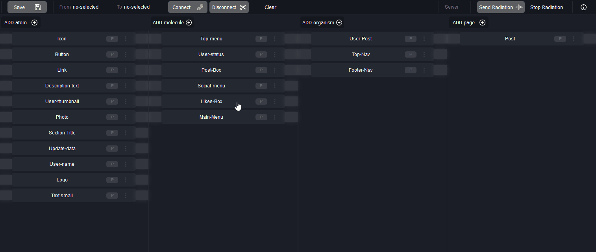

## Motivation
Fluorescence is the emission of light by a substance that has absorbed light or other electromagnetic radiation.  
This emission of light is only observable when the stimulant light is still providing light to the organism/object.  
Fluorescence in the life sciences is used generally as a non-destructive way of tracking or analysis of biological molecules.  
<small>**Source:** https://en.wikipedia.org/wiki/Fluorescence</small>

### Atomic Design


<small>**Source:** http://atomicdesign.bradfrost.com/chapter-2/</small>

#### Example of Atomic-Structure in **fluorescent-app**
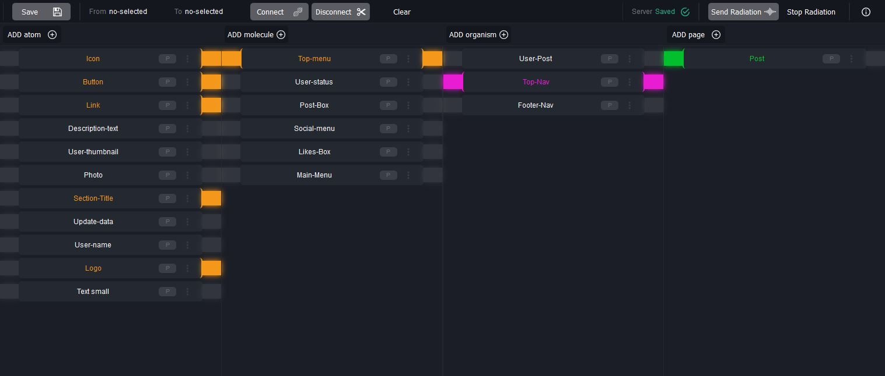  

## Installation
In Project directory

### Clone
```
git clone --depth=1 https://github.com/chema-mengibar/fluorescent-app.git .fluorescent
rm -rf ./.fluorescent/.git
rm -rf ./.fluorescent/.gitignore
```
### Install
```
cd .fluorescent
npm i
```

## Usage

The application needs a server to obtain and save the modifications in the repository-object.
```
npm run build
npm run serve
```

Open `localhost:8080` in your internet browser  

## Development
To continue with the development of the tool itself:  
1. Open a terminal and execute the command: `npm run serve`
2. Open another terminal and execute the command: `npm start`

## Configuration

`fluorescent-app\src\config.js`

### Server
It is possible to use the tooling with a local or remote server.  
If no url or port is specified,   
**for localhost:** (Express)
```
  url : 'http://127.0.0.1'
  port : '8080'
```
**and for remote:**   
For a remote server, the Php version has been implemented, in case node.js is not available:  
`fluorescent-app\server\index.php`
```
  url : 'http://{your.domain}/{sub-dir}/index.php'
  port : ''

```
It is necessary to consider the configuration of the http-headers:  
CORS, Allowed Methods, etc...

**Remote Directory Overview**
```
root
 |- app.html
 |- app.js
 |- index.php
 |- repository.json
```

### Panel Menu Actions
It is possible to configure in the application, which actions are allowed  and show/hide the buttons.
```
actions:{
  save: false,
  ...
```

### Layout
Column names and element types can be configured.  
**Default columns:** atom, molecule, organism, page

Example of element in repository-object:
```
items:[
  {
    type: 'atom',
    label: 'Button1',
    id: 'node-12345'
  },
  ...
```

### Plop
Select the file extension type: tsx or jsx in `plopfile.js`


## Server-Client Communication

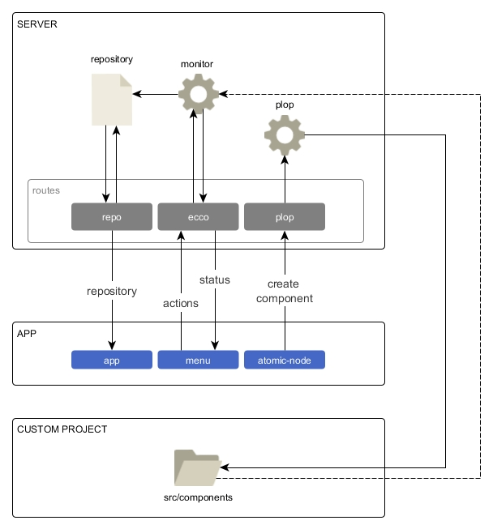

### Ecco
It is a service that controls sub-processes that are executed on the server, like "monitor"

### Plop
It is a service that executes the plop script, allowing the physical creation of components.  
**More info in** [plopjs.com](https://plopjs.com/)

### Monitor
It is a script that compares the schema and relation (parent/child) of the components with the physical structure and the "imports" in the project directory where the fluorescent application is used.

With this function it is possible for example to visualize:
- which components have been created
- if the planned connections are consistent.


## UI Elements & Features

### Items Selection

<br /><br />
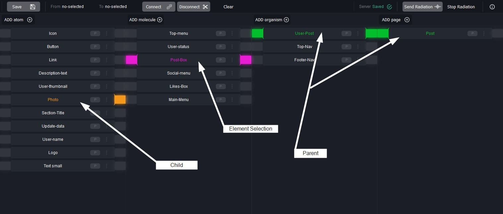  

### Items Connection
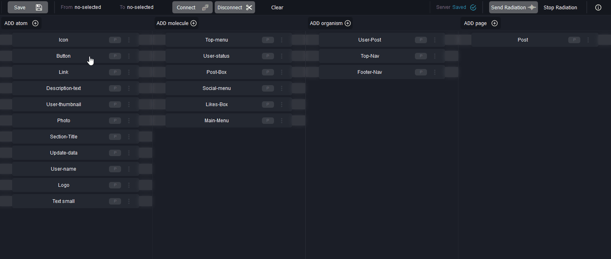

### Item Options
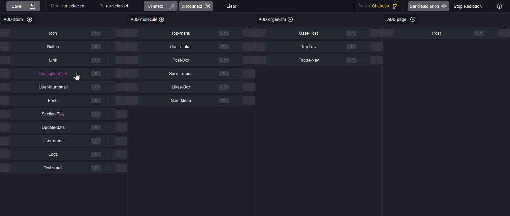  

### Item Add
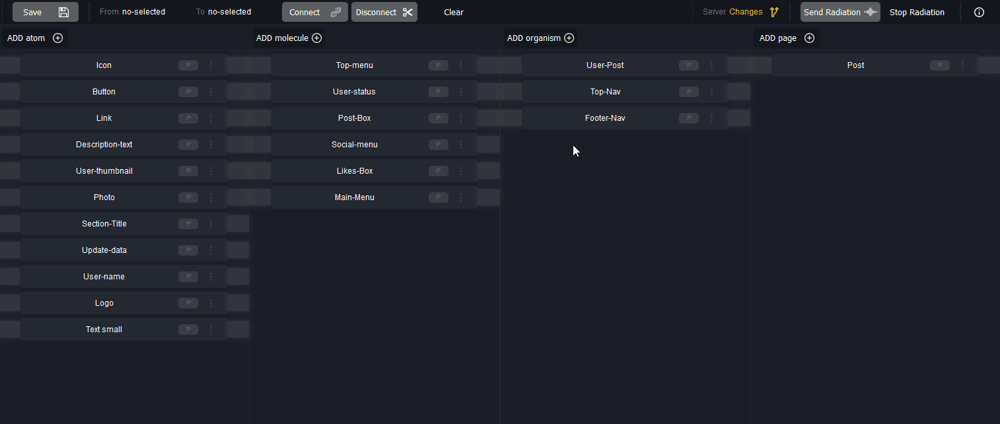  

### Command-actions modal
**Key:** SpaceBar
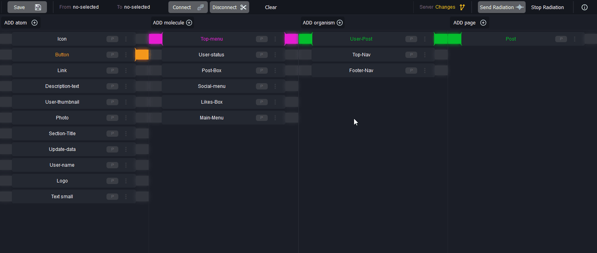  

### Server Action Status
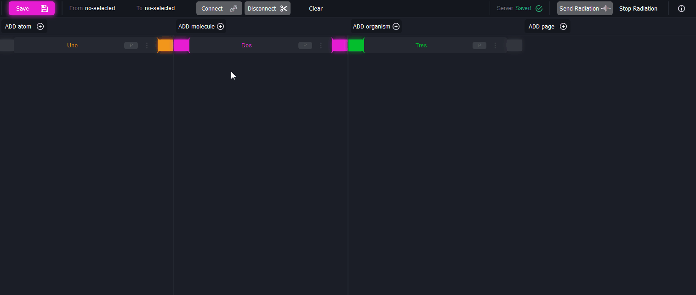  

### Component Generator and Monitor
**(see Server-Client Communication)**   
This function allows to create physically components (folder and script files) and observe the status between connexions and imports in script-files in the "ROOT/src/components" directory of the project where fluorescent-app is used.  

#### Step 1 - Planning your components
Start planning which components you will need.  <br /> Initially there are no connections and all elements have the " P " label of "planned".  

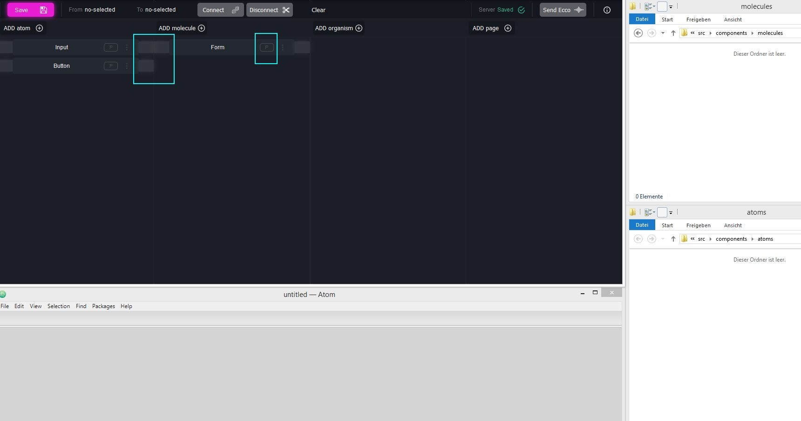

#### Step 2 - Create directory and component code files
In the panel is shown the option to "create element".  
So, a directory will be created and the files defined in the plop-templates

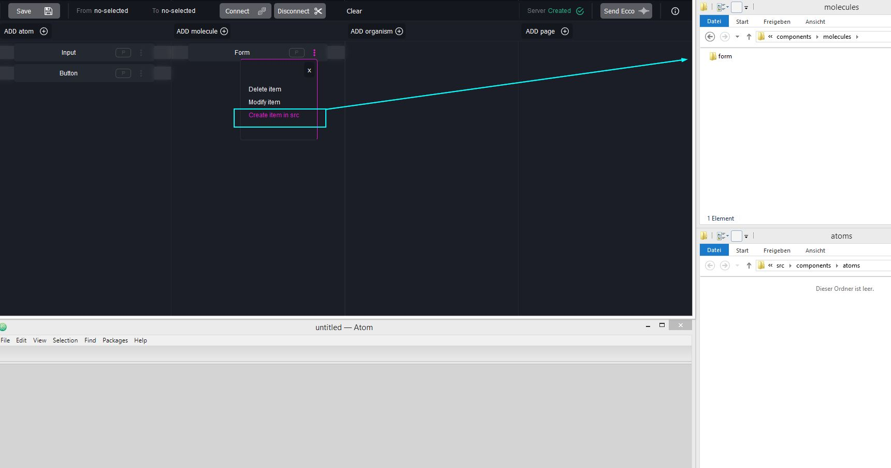

#### Step 3 - Monitoring the components status
Run the "ecco" function to update the status of the elements.   
The found elements receive the "C" label of "created".

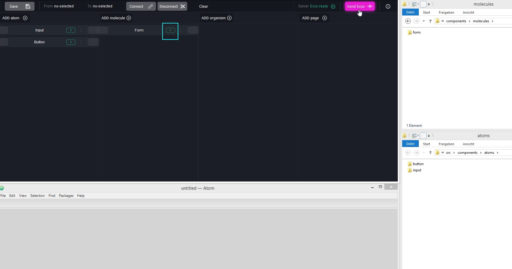

#### Step 4 - Create connections
Now we can create the connections between elements and run the function "ecco" again.  
If the parent component does not define imports of child elements as connections, the "CIe" label of "created but with import errors" will be displayed.

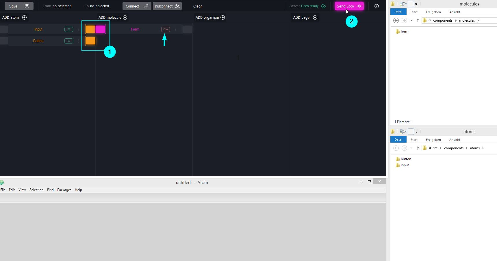

#### Step 5 - Update imports in code files
Add imports in any component file in the code editor

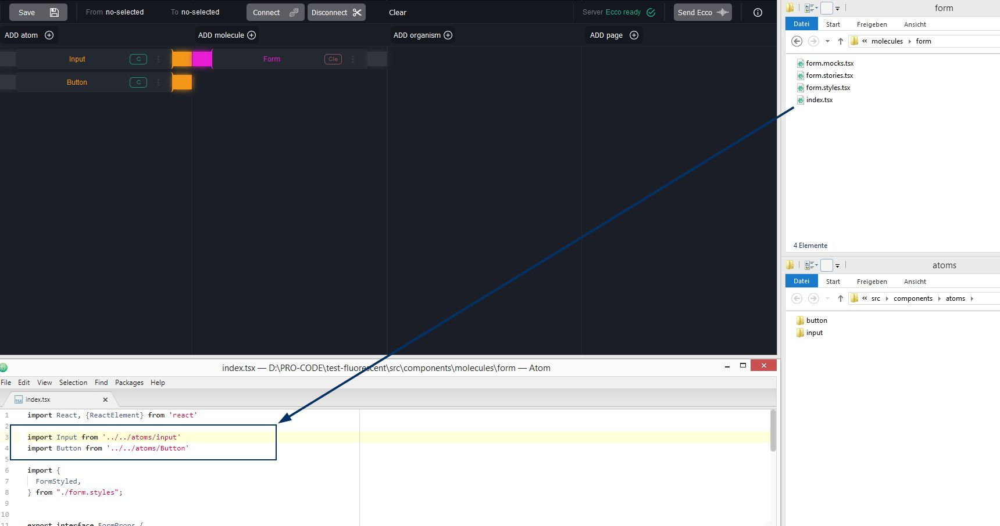

#### Step 6 - Update imports status flag
If we run the "ecco" function again and all imports of the component are satisfied,  
the label will be updated to "CI" of "created imports".

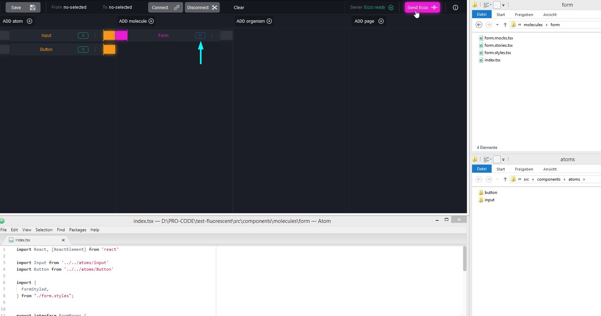

## Sources

### Icons
- www.flaticon.com/authors/dave-gandy
- www.flaticon.com/authors/dave-gandy
- www.flaticon.com/authors/freepik
- www.flaticon.com/authors/vaadin
- www.flaticon.com/authors/google

# License
MIT Licence Copyright © 2019 Jose Maria Mengibar

Permission is hereby granted, free of charge, to any person obtaining a copy of this software and associated documentation files (the "Software"), to deal in the Software without restriction, including without limitation the rights to use, copy, modify, merge, publish, distribute, sublicense, and/or sell copies of the Software, and to permit persons to whom the Software is furnished to do so, subject to the following conditions:

The above copyright notice and this permission notice shall be included in all copies or substantial portions of the Software.

THE SOFTWARE IS PROVIDED "AS IS", WITHOUT WARRANTY OF ANY KIND, EXPRESS OR IMPLIED, INCLUDING BUT NOT LIMITED TO THE WARRANTIES OF MERCHANTABILITY, FITNESS FOR A PARTICULAR PURPOSE AND NONINFRINGEMENT. IN NO EVENT SHALL THE AUTHORS OR COPYRIGHT HOLDERS BE LIABLE FOR ANY CLAIM, DAMAGES OR OTHER LIABILITY, WHETHER IN AN ACTION OF CONTRACT, TORT OR OTHERWISE, ARISING FROM, OUT OF OR IN CONNECTION WITH THE SOFTWARE OR THE USE OR OTHER DEALINGS IN THE SOFTWARE.
