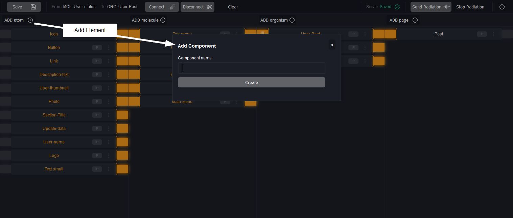

# fluorescent-app
A visualization tool for atomic design

## Motivation
Fluorescence is the emission of light by a substance that has absorbed light or other electromagnetic radiation.  
This emission of light is only observable when the stimulant light is still providing light to the organism/object.  
Fluorescence in the life sciences is used generally as a non-destructive way of tracking or analysis of biological molecules.  
<small>**Source:** https://en.wikipedia.org/wiki/Fluorescence</small>

### Atomic Design

  

<small>**Source:** http://atomicdesign.bradfrost.com/chapter-2/</small>

#### Example of Atomic-Structure in **fluorescent-app**
  

## Installation
```
npm i
```

## Usage

The application needs a server to obtain and save the modifications in the repository-object.

### Server
Open a terminal and execute the command:
```
npm run serve
```

### App
Open another terminal and execute the command:
```
npm start
```

## Configuration

`fluorescent-app\src\config.js`

### Server
It is possible to use the tooling with a local or remote server.  
Specify the url and port in the configuration file.

#### Local
The local server is based on Express.
```
server:{
  url : 'http://127.0.0.1',
  port : '8080',
},
```
#### Remote
For a remote server, the Php version has been implemented, in case node.js is not available:
`fluorescent-app\server\index.php`
```
server:{
  url : 'http://{your.domain}/{sub-dir}/index.php',
  port : '',
},
```
It is necessary to consider the configuration of the http-headers:  
CORS, Allowed Methods, etc...

**Remote Directory Overview**
```
root
 |- app.html
 |- app.js
 |- index.php
 |- repository.json
```

### Actions
It is possible to configure which actions are allowed in the application and show/hide the buttons.
```
actions:{
  save: false,
  ...
```

### Layout
Column names and element types can be configured.  
**Default columns:** atom, molecule, organism, page

Example of element in repository-object:
```
items:[
  {
    type: 'atom',
    label: 'Button1',
    id: 'node-12345'
  },
  ...
```

## UI Elements & Features

### Items Selection
  

### Items Connection


### Item Options
  

### Item Add
  

### Command-actions modal
**Keys:** Ctrl + P
  

### Server Action Status
  

### Directory Parser (not implemented)
  

## Sources

### Icons
- https://www.flaticon.com/authors/dave-gandy
- https://www.flaticon.com/authors/freepik
- https://www.flaticon.com/authors/vaadin
- https://www.flaticon.com/authors/google
